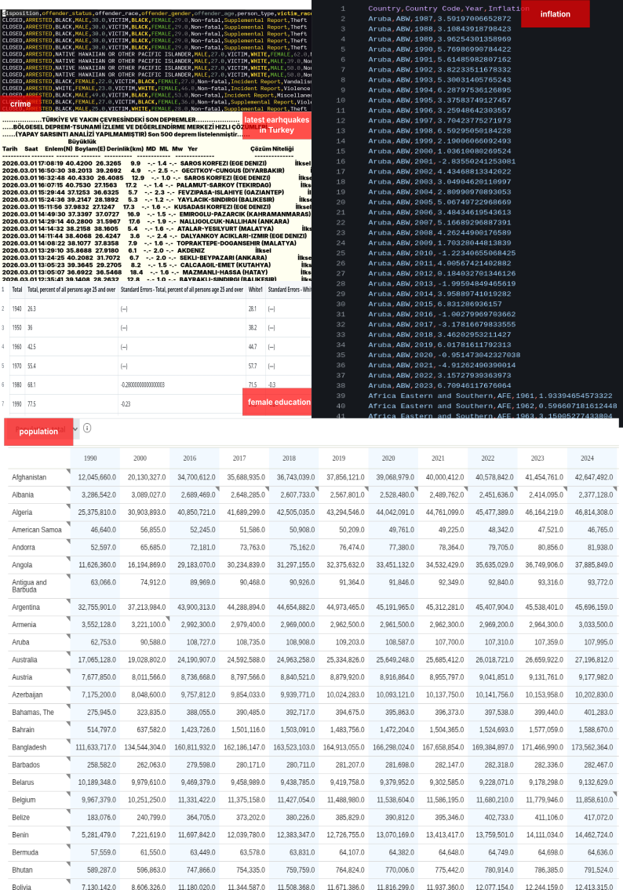
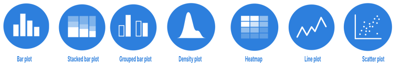
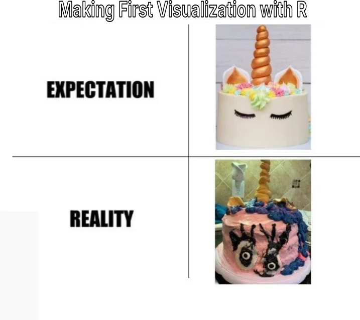
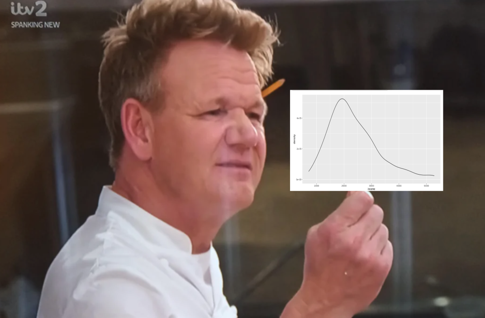

```{r}
library(tidyverse)
library(janitor)
```

# Visualizing data

## Why visualize data?

{style="height: 1050px; width: 1072px;"}

## Why visualize data?

-   Data visualization is not a decoration; it is an analytical instrument.

-   Human cognition is optimized for pattern recognition in visual space, not for reading tables or numbers.

::: fragment

:::

## Why visualize data?

### Why do we use R but don't learn the basic first?

-   Time limitations.
-   You can still do it! I personally know 2 people that did it (small smaple size i know...).
-   Encourage you to learn R

## Steps of Visualization {.small-slide}

1.  Get to know your data
2.  What is your message?
    -   What do you want to show?
3.  What types of variables do you have?
    -   Numeric: continuous (i.e. price, weight, distance etc) , or discrete (i.e. age, size of a family etc)?
    -   Non-numeric: nominal (i.e. gender, race, t-shirt color etc), ordinal (i.e. t-shirt size, schooling degree, satisfaction degree)
4.  What kind of plot can you use?
5.  Make the plot, understand it
6.  Make it beautiful

# Use the Chart Decision Table

# Lets Write Our first program!

## Hello World!

::: fragment
```{r}
#| echo: true
print("Hello world!")
```
:::

::: fragment
Can you introduce yourself to R?
:::

::: fragment
```{r}
#| echo: true
print("Hello R!, I am Mücahit")
```
:::

## Well Done!


# Before going into the data

## Necessary things

::: fragment
We first want to install the packages we want to use.
:::

::: fragment
```{r}
#| echo: true
#| eval: false
#| code-line-numbers: "1|2"
install.packagesgg("tidyverse") 
install.packages("janitor") #<1>
```

1.  Run these only if you never run them before. Installing a package once is enough.
:::

## Before going into the data

### Necessary things

::: fragment
We first want to install the packages we want to use.
:::

::: fragment
```{r}
#| echo: true
#| eval: false
#| code-line-numbers: "1|2"
install.packages("tidyverse") 
install.packages("janitor") #<1>
```

1.  Run these only if you never run them before. Installing a package once is enough.
:::

## Read the data

```{r warning=FALSE}
#| echo: true
#| eval: true
#| message: false
#| code-line-numbers: "1-2|3|4-5"
library(tidyverse) # <1>
library(janitor) # <1>
read.csv("https://raw.githubusercontent.com/mucahitzor/IKT2010/refs/heads/main/data/earnings.csv") %>%  # <2>
  as_tibble() -> earnings # <3>
```

1.  Use the tidyverse, and janitor, libraries so we can use the the functions that come with them
2.  My data is a csv file in this path (a path is where the data is), read it, and then do the following ( %\>% )
3.  show it as a `tibble`: a tibble is a nice way to see our data. With `-> earnings` we are saying that save this data set into our memory so we can use it whenever we want.

## Have a look at the data

::: fragment
lets see how does the data look like. There are two ways:

```{r}
#| echo: true
earnings  # <1>
```

1.  Just writing the name of the data shows us how it looks like on the console
:::

::: fragment
```{r}
#| eval: false
#| echo: true
earnings %>% view() # <1>
```

1.  take my dataset, and then make me view it visually in more detail
:::

## Understanding Our Data {.small-slide}

### What are our variables?

::: fragment
```{r}
#| echo: true
#| eval: false
earnings # <1>
```

1.  lets see how our data look like again
:::

::: fragment
To see the variable names and information on [numerical variables]{.red-text} we use the function `summary()`
:::

::: fragment
So we need to tell R to
:::

::: fragment
-   take my data set named `earnings`
:::

::: fragment
-   and do the thing i will tell you on the next line (`%>%`)
:::

::: fragment
-   give me the `summary()` of the data set.
:::

::: fragment
```{r}
#| echo: true
earnings %>% 
  summary()
```
:::

## Understanding Our Data {.small-slide}

### What are our variables?

::: fragment
For [non-numeric]{.red-text} variables (like gender) we tell R to.
:::

::: fragment
Take my data set named `earnings` and do the following ( %\>% ).
:::

::: fragment
apply `tabyl({variable name})` to show statistics about the `variable name` we want to see. We want to apply `tabyl()` function our non-numeric variable named `gender`.
:::

::: fragment
```{r}
#| echo: true
earnings %>% # <1>
  tabyl(gender) # <2>
```

1.  Take my data set named `earnings`.
2.  using the `tabyl()` function, show me statistics of variable `gender`.
:::

## Understanding Our Data {.small-slide}

### Our Goal Today: How is income distributed?

-   We are trying to find out how income is distributed.

-   Income is a continuous variable.

-   So so how one continuous variable is distributed, we can use a histogram or a density plot.

## How is income distributed? {.small-slide}

### Distribution of one continuous variable

#### Histogram

::: fragment
Lets have a look at the data again
:::

::: fragment
```{r}
earnings
```
:::

-   We see the first 10 individual's income values.
-   Each row (observation) is one person.
-   But we have 200 observations that we need to somehow understand how `income` is distributed.
-   This is impossible just looking at the data in a table.
-   We can have a look at the summary statistics to see the min, quartiles, median, mean, and max. But this still does not show us the *shape*.

::: fragment
```{r}
#| echo: true
earnings %>%
  summary()
```
:::

## How is income distributed? {.small-slide}

### Distribution of one continuous variable

#### Histogram

-   A histogram groups continuous data into intervals (bins) and counts how many observations fall inside each interval.

-   A bin is basically an interval. For example, each of the following is a bin with width of 1000.

    -   "0-1000"
    -   "1000-2000"
    -   "2000-3000"

-   We need to group the continuous data into bins and count how many of the observations belong to each bin.

-   Choosing binwidth is somewhat depends on situation, try different binwidth and you'll have different shapes.

## How is income distributed? {.small-slide}

### Distribution of one continuous variable

#### Histogram

::: fragment
```{r}
#| echo: true
earnings %>% 
  summary()
```
:::

-   Lets start drawing a histogram of income *by hand* with 1000 bin width with our hand. Our bins will start from the minimum value of income.

    -   "9000-10.000", "10.000-11.0000", "11.000-12.000"...

-   For each observation we look at the income of the person and identify which bin it belongs to and start counting.

-   Before doing this we first need to place our x and y axises.

    -   Draw one x axis and one y axis,
    -   On x axis we have income, in bins of 1000, starting from 9000.
    -   On y axis we always have count, showing the number of observations that belongs to each bin.

## How is income distributed? {.small-slide}

### Distribution of one continuous variable

#### Histogram

::: fragment
Lets plot the first 10 observations.

```{r}
earnings
```
:::

-   It is very tiring to go over all 200 observations.

-   Instead we can tell R to do it for us!

## How is income distributed? {.small-slide}

### Distribution of one continuous variable

#### Histogram

::: fragment
Take my data set named `earnings`,
:::

::: fragment
```{r}
#| echo: true
#| eval: false
earnings
```
:::

::: fragment
I want to make a visualization, take my data set and apply `ggplot`.
:::

::: fragment
What we will have is a blank piece of paper. We did not specified our axises yet.
:::

::: fragment
```{r}
#| echo: true
earnings %>% 
  ggplot()
```
:::

## How is income distributed? {.small-slide}

### Distribution of one continuous variable

#### Histogram

::: fragment
Similar to drawing with hand, we first draw the x and y axis. To do this with `R` we use the function `aes(x = variable name`). And we *add* this into our existing blank page using `+` symbol.
:::

::: fragment
`+` will always be at the end of the lines.
:::

::: fragment
```{r}
#| echo: true
earnings %>% # <1>
  ggplot() +  # <2>
  aes(x=income) # <3>
```

1.  Take my data set named `aernings`
2.  I want to make a vizualization
3.  My variable on `x` axis is `income`
:::

::: fragment
For histograms, we only need to give the name of the `x` variable, `R` will count each observations by itself!
:::

## How is income distributed? {.small-slide}

### Distribution of one continuous variable

#### Histogram

::: fragment
Now it is time to tell R to make a `histogram`.
:::

::: fragment
We use `geom_{plot type}` to tell R what kind of plot we want.
:::

::: fragment
For example, to make a histogram, we use `geom_histogram()`.
:::

::: fragment
To make a density plot, we use `geom_density()`.
:::

::: fragment
To make a bar plot, we use `geom_bar()`.
:::

::: fragment
To make a scatter point plot , we use `geom_point()`.
:::

## How is income distributed? {.small-slide}

### Distribution of one continuous variable

#### Histogram

-   Now lets tell R to
    -   Use my data set named `earnings` and then ( %\>% ),
    -   Use `ggplot()` to make a vizualization, `+`,
    -   My `x` variable is `income`, and on top of that i am adding (`+`),
    -   A histogram.

## How is income distributed? {.small-slide}

### Distribution of one continuous variable

#### Histogram

::: fragment
```{r}
#| echo: true
earnings %>% 
  ggplot() +
  aes(x = income) +
  geom_histogram()
```
:::

## How is income distributed?

### Distribution of one continuous variable

#### Histogram

{style="height: 500px; width: 1072px;"}

## How is income distributed? {.small-slide}

### Distribution of one continuous variable

#### Histogram

::: fragmen
First fix this awful plot with start by adding a theme on top of our visualization. `theme_{theme name}` allows us to use a theme. Make sure `theme` is always at the last line.
:::

::: fragment
```{r}
#| echo: true
earnings %>% 
  ggplot() +
  aes(x = income) +
  geom_histogram() +
  theme_classic()
```
:::

## How is income distributed? {.small-slide}

### Distribution of one continuous variable

#### Histogram

::: fragment
By default `R` chooses some binwidth by itself inside `geom_histogram()`, even though we don't see it `geom_histogram(binwidth = 30)`. We want to change binwidth to what we want: `binwidth=1000`
:::

::: fragment
```{r}
#| echo: true
earnings %>% 
  ggplot() +
  aes(x = income) +
  geom_histogram(binwidth = 1000) +
  theme_classic()
```
:::

## How is income distributed? {.small-slide}

### Distribution of one continuous variable

#### Histogram

::: fragment
R also chooses which color to fill the bins with. We want to change the color of the filling to `lightskyblue` inside `geom_histogram(binwidth = 1000, fill={"name of the color"})`.
:::

::: fragment
Note that we use `,` to separate each argument.
:::

::: fragment
```{r}
#| echo: true
earnings %>% 
  ggplot() +
  aes(x = income) +
  geom_histogram(binwidth = 1000, fill = "lightskyblue") +
  theme_classic()
```
:::

## How is income distributed? {.small-slide}

### Distribution of one continuous variable

#### Histogram

::: fragment
To change the color of the edges of the bins we use `color={name of the color}` argument inside `geom_histogram()`. Lets change it to `black`.
:::

::: fragment
```{r}
#| echo: true
earnings %>% 
  ggplot() +
  aes(x = income) +
  geom_histogram(binwidth = 1000, fill = "lightskyblue", color = "black") +
  theme_classic()
```
:::

## How is income distributed? {.small-slide}

### Distribution of one continuous variable

#### Histogram

-   Now, it is your time to:
    -   Choose a different binwidth to see how the shape changes,
    -   Choose another fill, and edge color,
    -   Choose another theme
        -   To see the theme options, delete the theme `theme_classic()` we set earlier and start typing `theme_` R will show you suggestions.

## How is income distributed? {.small-slide}

### Distribution of one continuous variable

#### Histogram

-   Before we move on to interpret the plot, i want to increase the number of values in the `x` axis. Currently we have 5 values which are not really enough to see the distribution.

-   To increase the number of values from 5 to 10 on the `x` axis, use `scale_x_continuous(n.breaks=10)` layer.

-   Remember to add this before the theme!

## How is income distributed? {.small-slide}

### Distribution of one continuous variable

#### Histogram

::: fragment
```{r}
#| echo: true
earnings %>% 
  ggplot() +
  aes(x = income) +
  geom_histogram(binwidth = 1000, fill = "lightskyblue", color = "black") +
  scale_x_continuous(n.breaks=10) +
  theme_classic()
```
:::

## How is income distributed? {.small-slide}

### Distribution of one continuous variable

#### Histogram

::: fragment
We have the same problem in y axis as well.
:::

::: fragment
How can we increase the number of values in y axis? For `x` axis the function was `scale_x_continuous(n.breaks=10)`. Can you set the number of breaks on y axis to 10?
:::

::: fragment
`scale_y_continuous(n.breaks =10)`
:::

::: fragment
```{r}
#| echo: true
earnings %>% 
  ggplot() +
  aes(x = income) +
  geom_histogram(binwidth = 1000, fill = "lightskyblue", color = "black") +
  scale_x_continuous(n.breaks=10) +
  scale_y_continuous(n.breaks=10) +
  theme_classic()
```
:::

## How is income distributed? {.small-slide}

### Distribution of one continuous variable

#### Histogram

Now it is time to interpret the plot.

-   What do we see?
    -   Minimum income seems to be around 9000, while maximum is around 54,000.
    -   Most of the workers earn 15-25,000 TL
    -   There are some people earning a lot and very few. Who are they? Interns? Managers?
-   What is the shape?
    -   We have long bins (bars) on the left side -\> Right skewed (i know it does not make sense to me either, it is what it is)
    -   Because the distribution is right-skewed, the mean will likely be larger than the median. The people on the right side are ruining the distribution -\> outliers?
-   What is the center?
    -   The bulk of the workers seem to earn around the middle of 15,000 - 20,000 range.

## How is income distributed? {.small-slide}

### Distribution of one continuous variable

#### Histogram

-   Now that we understood our plot, we should make other people understand too by adding a `title` and a `subtitle`.

-   Use the layer `labs(title = "{your title}", subtitle = "{your subtitle}", x = "{x axis label}", y = "{y axis label}")`.

-   When we write sentences we write them between quotation marks.

-   Right: `labs(title = "Monthly earnings...")`

-   Wrong: `labs(title = Monthlyh earnings..)`

-   Right: `labs(x = "Income", y = "N. of observations")`

-   Wrong: `labs(x = Income, y = N. of observations)`

## How is income distributed? {.small-slide}

### Distribution of one continuous variable

#### Histogram

::: fragment
```{r}
#| echo: true
#| eval: false
earnings %>% 
  ggplot() +
  aes(x = income) +
  geom_histogram(binwidth = 1000, fill = "lightskyblue", color = "black") +
  scale_x_continuous(n.breaks = 10) +
  scale_y_continuous(n.breaks = 10) +
    labs(
    title = "Monthly Earnings Distribution of Manufacturing Workers in Cilek Mobilya, Mamak",
    subtitle = "Most workers earn between 15,000–25,000 TL; distribution is right-skewed with a small number of high-income outliers",
    x = "Monthly Earnings (Turkish Lira, TL)",
    y = "Number of Workers"
  ) +
  theme_classic()
```
:::

## How is income distributed? {.small-slide}

### Distribution of one continuous variable

#### Histogram

::: fragment
```{r}
#| echo: false
earnings %>% 
  ggplot() +
  aes(x = income) +
  geom_histogram(binwidth = 1000, fill = "lightskyblue", color = "black") +
  scale_x_continuous(n.breaks = 10) +
  scale_y_continuous(n.breaks = 10) +
    labs(
    title = "Monthly Earnings Distribution of Manufacturing Workers in Cilek Mobilya, Mamak",
    subtitle = "Most workers earn between 15,000–25,000 TL; distribution is right-skewed with a small number of high-income outliers",
    x = "Monthly Earnings (Turkish Lira, TL)",
    y = "Number of Workers"
  ) +
  theme_classic()
```
:::

## How is income distributed? {.small-slide}

### Distribution of one continuous variable

#### Density Plot

-   Remember Statistics I?
    -   We talked about random continuous random variables and their distributions.
    -   We talked about density functions (uniform distribution, normal distribution etc.)

## How is income distributed? {.small-slide}

### Distribution of one continuous variable

#### Density Plot

-   $$
    f(x) = \frac{1}{\sigma \sqrt{2\pi}}
    \exp\left(-\frac{(x-\mu)^2}{2\sigma^2}\right)
    $$

::: fragment
```{r}
set.seed(123)
normal_data <- tibble(
  x = rnorm(500, mean = 50, sd = 10)
)
curve(dnorm(x, mean = 50, sd = 10),
      from = 10, to = 90,
      col = "blue", lwd = 2,
      ylab = "Density",
      xlab = "x",
      main = "Normal Density Function")
```
:::

## How is income distributed? {.small-slide}

### Distribution of one continuous variable

#### Density Plot

-   Since income is a continuous random varaible, one alternative to use histogram is to use a `density` plot.
-   In a density plot, instead of grouping the data into bins, R estimates a continuous curve that represents the distribution. (It basically calculates the density function and plots it).
-   Lets see how income is distributed with a density plot.

## How is income distributed? {.small-slide}

### Distribution of one continuous variable

#### Density Plot

::: fragment
We want to use our data named `earnings` and do ( %\>% )
:::

::: fragment
`ggplot()` visualization to it
:::

::: fragment
Add `x` axis variable as `income`
:::

::: fragment
Add density geometry: `geom_density()`
:::

## How is income distributed? {.small-slide}

### Distribution of one continuous variable

#### Density Plot

::: fragment
```{r}
#| code-line-numbers: "1|2|3|4"
#| echo: true
earnings %>%  # <1>
  ggplot() + # <2>
  aes(x = income) + # <3>
  geom_density() # <4>
```

1.  We want to use our data named `earnings` and do ( %\>% )
2.  Apply `ggplot()` visualization to it
3.  Add `x` axis variable as `income`
4.  Add density geometry: `geom_density()`
:::

## How is income distributed? {.small-slide}

### Distribution of one continuous variable

#### Density Plot

{style="height: 600; width: 700;"}

## How is income distributed? {.small-slide}

### Distribution of one continuous variable

#### Density Plot

::: fragment
Immediately apply a theme you prefer by.
:::

::: fragment
Well, before that, lets install a nice package to use a nice theme
:::

::: fragment
We want to install the package `ggthemes` to use its themes
:::

::: fragment
```{r}
#| echo: true
#| eval: false
install.packages("ggthemes")
```
:::

## How is income distributed? {.small-slide}

### Distribution of one continuous variable

#### Density Plot

::: fragment
To be able use the themes from `ggthemes` package, we need to tell R to use the package
:::

::: fragment
```{r}
#| echo: true
library(ggthemes)
```
:::

::: fragment
We were here
:::

::: fragment
```{r}
#| code-line-numbers: "1|2|3|4"
#| echo: true
#| eval: false
earnings %>%  # <1>
  ggplot() + # <2>
  aes(x = income) + # <3>
  geom_density() # <4>
```
:::

## How is income distributed? {.small-slide}

### Distribution of one continuous variable

#### Density Plot

::: fragment
Now we add a theme of your choice by starting to type `theme_` on the right side of the suggestions you will see `ggthemes`, choose one from there.
:::

::: fragment
```{r}
#| echo: true
earnings %>%  
  ggplot() + 
  aes(x = income) + 
  geom_density() +
  theme_economist()
```
:::

## How is income distributed? {.small-slide}

### Distribution of one continuous variable

#### Density Plot

I don't like the black color of the density line. Lets change it to "azure4" using the `color` argument inside `geom_density(color = {"color you prefer"})`

::: fragment
```{r}
#| echo: true
earnings %>%  
  ggplot() + 
  aes(x = income) + 
  geom_density(color = "azure4") +
  theme_economist()
```
:::

## How is income distributed? {.small-slide}

### Distribution of one continuous variable

#### Density Plot

::: fragment
The width of the line seems a bit thin, can we increase it with `linewidth` argument inside `geom_density()`. By default it is set to `geom_density(linewidth = 1)`.
:::

::: fragment
`geom_density(color = {"color you prefer"}, linewidth = {width number you prefer})`
:::

::: fragment
```{r}
#| echo: true
earnings %>%  
  ggplot() + 
  aes(x = income) + 
  geom_density(color = "azure4", linewidth = 1.5) +
  theme_economist()
```
:::

## How is income distributed? {.small-slide}

### Distribution of one continuous variable

#### Density Plot

::: fragment
Label of the `y` axis, changed, because we are not showing counts anymore. We are showing density (or probability density). Our heights now represent probability density, not the number of workers; we should reflect this in `y` label.
:::

::: fragment
The x and y values seem ok. we don't need to use `scale_x_continuous()` and `scale_y_continuous()`.
:::

::: fragment
While our title is still fine, our subtitle could be better since we are not showing counts anymore. Lets change it to "The highest concentration of earnings lies between 15,000–25,000 TL; the distribution is right-skewed with a long upper tail"
:::

::: fragment
```{r}
#| echo: true
#| eval: false
earnings %>%  
  ggplot() + 
  aes(x = income) + 
  geom_density(color = "azure4", linewidth = 1.5) +
    labs(
    title = "Monthly Earnings Distribution of Manufacturing Workers in Cilek Mobilya, Mamak",
    subtitle = "The highest concentration of earnings lies between 15,000–25,000 TL; the distribution is right-skewed",
    x = "Monthly Earnings (Turkish Lira, TL)",
    y = "Probability Density"
  ) +
  theme_economist()
```
:::

## How is income distributed? {.small-slide}

### Distribution of one continuous variable

#### Density Plot

::: fragment
```{r}
earnings %>%  
  ggplot() + 
  aes(x = income) + 
  geom_density(color = "azure4", linewidth = 1.5) +
    labs(
    title = "Monthly Earnings Distribution of Manufacturing Workers in Cilek Mobilya, Mamak",
    subtitle = "Most workers earn between 15,000–25,000 TL; distribution is right-skewed with a small number of high-income outliers",
    x = "Monthly Earnings (Turkish Lira, TL)",
    y = "Number of Workers"
  ) +
  theme_economist()
```
:::

## How is income distributed between genders? {.small-slide}

### Distribution of one continuous variable over a group

#### Density Plot

-   Now, what if we wanted to see whether the income of the workers change based on their gender?

-   Since we have gender for each observation, we can use this information as well.

-   There are different ways to do this.

    -   We can change the type of line based on gender.
    -   We can change the color of the line based on gender.

## How is income distributed between genders? {.small-slide}

### Distribution of one continuous variable over a group

#### Density Plot - change line type based on gender

::: fragment
This was our code and plot
:::

::: fragment
```{r}
#| echo: true
earnings %>%  
  ggplot() + 
  aes(x = income) + 
  geom_density(color = "azure4", linewidth = 1.5) +
    labs(
    title = "Monthly Earnings Distribution of Manufacturing Workers in Cilek Mobilya, Mamak",
    subtitle = "Most workers earn between 15,000–25,000 TL; distribution is right-skewed with a small number of high-income outliers",
    x = "Monthly Earnings (Turkish Lira, TL)",
    y = "Number of Workers"
  ) +
  theme_economist()
```
:::

## How is income distributed between genders? {.small-slide}

### Distribution of one continuous variable over a group

#### Density Plot - change line type based on gender

::: fragment
```{r}
#| echo: true
#| eval: false
earnings %>%  
  ggplot() + 
  aes(x = income) + 
  geom_density(color = "azure4", linewidth = 1.5) +
    labs(
    title = "Monthly Earnings Distribution of Manufacturing Workers in Cilek Mobilya, Mamak",
    subtitle = "Most workers earn between 15,000–25,000 TL; distribution is right-skewed with a small number of high-income outliers",
    x = "Monthly Earnings (Turkish Lira, TL)",
    y = "Number of Workers"
  ) +
  theme_economist()
```
:::

::: fragment
-   Now we want to change the color of the line, based on a `variable`.
:::

::: fragment
-   Can we change the color inside `geom_density(color = "azure4")` to `geom_density(color = gender)`?
:::

::: fragment
-   Try it yourself
:::

## How is income distributed between genders? {.small-slide}

### Distribution of one continuous variable over a group

#### Density Plot - change line type based on gender

::: fragment
```{r}
#| code-highlight-lines: "4"
#| echo: true
#| eval: false
earnings %>%  
  ggplot() + 
  aes(x = income) + 
  geom_density(color = gender, linewidth = 1.5) +
    labs(
    title = "Monthly Earnings Distribution of Manufacturing Workers in Cilek Mobilya, Mamak",
    subtitle = "Most workers earn between 15,000–25,000 TL; distribution is right-skewed with a small number of high-income outliers",
    x = "Monthly Earnings (Turkish Lira, TL)",
    y = "Number of Workers"
  ) +
  theme_economist()
```
:::

::: fragment
We get an error `Error: object 'gender' not found`
:::

::: fragment
This is because R thinks we give it a color name, like red, blue, or green. But `gender` is not a color name. It is a `variable`
:::

::: fragment
Whenever we want to change something based on a *variable*, we do it inside `aes()`, not `geom_`.
:::

::: fragment
This is why we set `aes(x = income)` *instead of* `geom_density(x = income)`. Because `x` should be a varaible, not just one value.
:::

::: fragment
So what we want to do is to go upstairs to `aes(x = income)`, and add `color = gender` argument to it, seperating them with `,`
:::

## How is income distributed? {.small-slide}

### Distribution of one continuous variable over a group

#### Density Plot

::: fragment
```{r}
#| echo: true
earnings %>%  
  ggplot() + 
  aes(x = income, color  = gender) + 
  geom_density(linewidth = 1.5) +
    labs(
    title = "Monthly Earnings Distribution of Manufacturing Workers in Cilek Mobilya, Mamak",
    subtitle = "Most workers earn between 15,000–25,000 TL; distribution is right-skewed with a small number of high-income outliers",
    x = "Monthly Earnings (Turkish Lira, TL)",
    y = "Number of Workers"
  ) +
  theme_economist()
```
:::

## How is income distributed? {.small-slide}

### Distribution of one continuous variable over a group

#### Density Plot

-   We added the gender information into our plot

-   Now we are no longer describing *one distribution*

-   We are comparing *two distributions*

-   The thing we show now is "Do earnings differ by gender?"

-   Our title and subtitle should reflect this

-   Change the title to "Monthly Earnings by Gender"

    -   Lets assume our audience know the data comes from Cilek Mobilya, Mamak (to shorten the title)

-   Change the subtitle to "No substantial difference between male and female workers."

## How is income distributed? {.small-slide}

### Distribution of one continuous variable over a group

#### Density Plot

::: fragment
```{r}
#| echo: true
earnings %>%  
  ggplot() + 
  aes(x = income, color  = gender) + 
  geom_density(linewidth = 1.5) +
    labs(
    title = "Monthly Earnings by Gender",
    subtitle = "No substantial visual difference between male and female workers",
    x = "Monthly Earnings (Turkish Lira, TL)",
    y = "Number of Workers"
  ) +
  theme_economist()
```
:::

## How is income distributed? {.small-slide}

### Distribution of one continuous variable over a group

#### Density Plot

::: fragment
Now, instead of the color, we could have changed the `linetype` based on gender.
:::

::: fragment
Can you do it?
:::

::: fragment
```{r}
#| echo: true
#| eval: false
earnings %>%  
  ggplot() + 
  aes(x = income, linetype  = gender) + 
  geom_density(linewidth = 1.5) +
    labs(
    title = "Monthly Earnings by Gender",
    subtitle = "No substantial visual difference between male and female workers",
    x = "Monthly Earnings (Turkish Lira, TL)",
    y = "Number of Workers"
  ) +
  theme_economist()
```
:::

## How is income distributed? {.small-slide}

### Distribution of one continuous variable over a group

#### Density Plot

::: fragment
```{r}
earnings %>%  
  ggplot() + 
  aes(x = income, linetype  = gender) + 
  geom_density(linewidth = 1.5) +
    labs(
    title = "Monthly Earnings by Gender",
    subtitle = "No substantial visual difference between male and female workers",
    x = "Monthly Earnings (Turkish Lira, TL)",
    y = "Number of Workers"
  ) +
  theme_economist()
```
:::

## How is income distributed? {.small-slide}

### Distribution of one continuous variable over a group

#### Histogram

::: fragment
Remember our histogram code?
:::

::: fragment
```{r}
#| echo: true
earnings %>% 
  ggplot() +
  aes(x = income) +
  geom_histogram(binwidth = 1000, fill = "lightskyblue", color = "black") +
  scale_x_continuous(n.breaks = 10) +
  scale_y_continuous(n.breaks = 10) +
    labs(
    title = "Monthly Earnings Distribution of Manufacturing Workers in Cilek Mobilya, Mamak",
    subtitle = "Most workers earn between 15,000–25,000 TL; distribution is right-skewed with a small number of high-income outliers",
    x = "Monthly Earnings (Turkish Lira, TL)",
    y = "Number of Workers"
  ) +
  theme_classic()
```
:::

## How is income distributed? {.small-slide}

### Distribution of one continuous variable over a group

#### Histogram

::: fragment
Instead of setting one color to fill the bins, lets `fill` the bins based on gender. While there, change the theme to a nicer one.
:::

::: fragment
```{r}
#| echo: true
earnings %>% 
  ggplot() +
  aes(x = income, fill = gender) +
  geom_histogram(binwidth = 1000, color = "black",) +
  scale_x_continuous(n.breaks = 10) +
  scale_y_continuous(n.breaks = 10) +
    labs(
    title = "Monthly Earnings Distribution of Manufacturing Workers in Cilek Mobilya, Mamak",
    subtitle = "Most workers earn between 15,000–25,000 TL; distribution is right-skewed with a small number of high-income outliers",
    x = "Monthly Earnings (Turkish Lira, TL)",
    y = "Number of Workers"
  ) +
  theme_classic()
```
:::

## How is income distributed? {.small-slide}

### Distribution of one continuous variable over a group

#### Histogram

-   So many things are wrong with this plot

-   Use only one variable in histograms, if you need to make a group based distribution comparison use `density` plot.

-   If your goal is to show "How many workers fall into each income range?", histogram is the right plot (density plot is also ok btw, the interpretation differs slightly.).

    -   y axis shows counts
    -   You can say there are about 10 workers earning between .. - .. TL.

-   If your goal is to show "Do the income distributions differ by gender?", density plot is the right one

    -   its shape makes us compare groups easier.
    -   we have no overlap to worry about.
    -   when we compare distributions, it is better to use a density plot.
