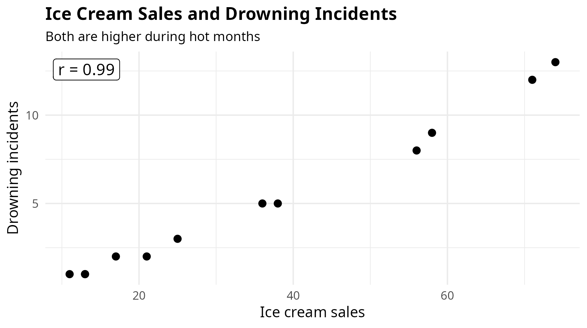
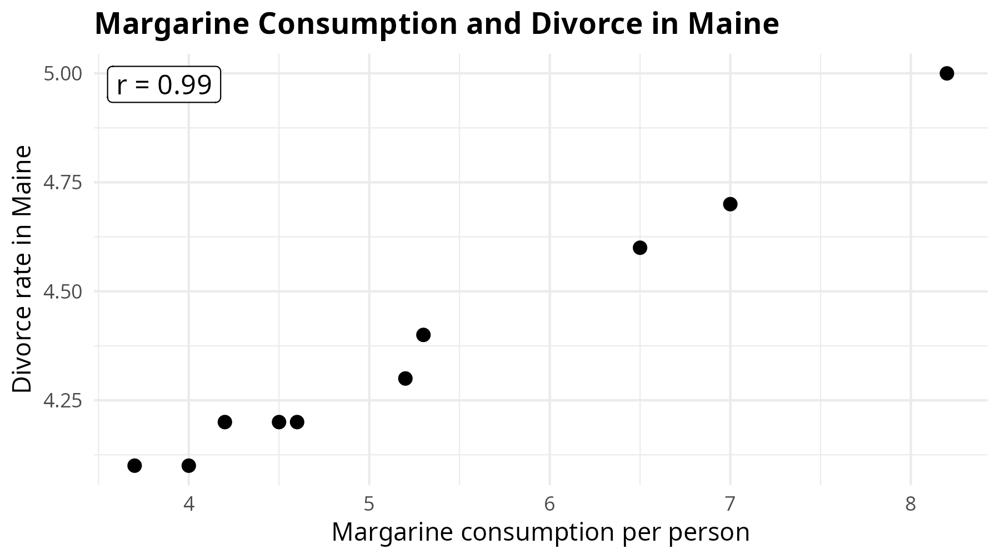
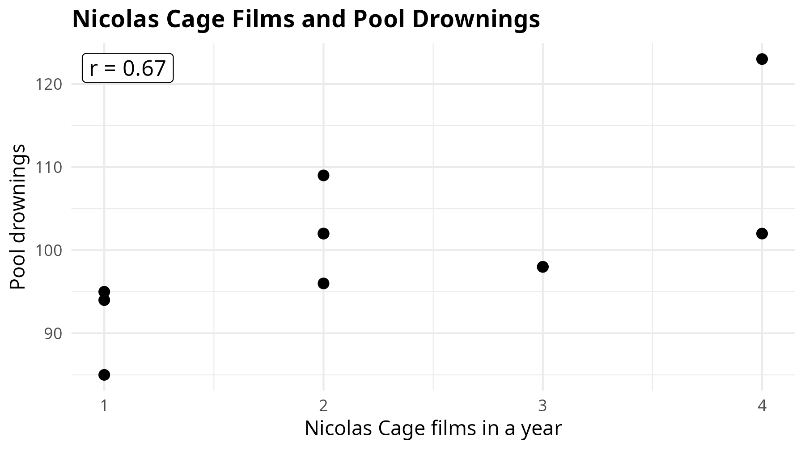

```{r}
#| echo: false
#| message: false
#| warning: false
library(tidyverse)
```

# Correlation

## What are we asking? {.small-slide}

-   Correlation is useful when we have **two numeric variables**.

::: fragment
Today we will ask questions like:
:::

::: fragment
-   Do bigger-budget movies earn more money?
-   Do bigger-budget horror movies earn a better return per dollar?
-   Do movies with longer titles get higher IMDb scores?
-   Do movies with more faces on the poster get higher IMDb scores?
:::

## What is correlation? {.small-slide}

-   Correlation measures the relationship between **two numeric variables**.

::: fragment
It tells us two things:
:::

::: fragment
-   **Direction**: do the variables move in the same direction or opposite directions?
-   **Strength**: how clear is the pattern?
:::

::: fragment
Correlation is about the overall pattern in the data.
:::

## Positive correlation {.small-slide}

-   A [positive correlation]{.red-text} means:

::: fragment
> As one variable increases, the other variable tends to increase too.
:::

::: fragment
Examples:

-   larger movie budgets and higher box office gross
-   more votes and higher popularity
-   more people watching and more online discussion
:::

::: fragment
The points usually move upward from left to right.
:::

## Negative correlation {.small-slide}

-   A [negative correlation]{.red-text} means:

::: fragment
> As one variable increases, the other variable tends to decrease.
:::

::: fragment
Examples:

-   higher ticket price and fewer tickets sold
-   higher budget and lower return per dollar
-   longer waiting time and lower customer satisfaction
:::

::: fragment
The points usually move downward from left to right.
:::

## No clear correlation {.small-slide}

-   Sometimes there is no clear relationship.

::: fragment
Example:

> Movie title length and IMDb score
:::

::: fragment
The points look like a cloud with no clear direction.
:::

## The correlation coefficient {.small-slide}

-   Correlation is often summarized with a number called $r$.

::: fragment
The formula for Pearson's correlation coefficient is:

$$
r = \frac{\sum (x_i - \bar{x})(y_i - \bar{y})}
{\sqrt{\sum (x_i - \bar{x})^2 \sum (y_i - \bar{y})^2}}
$$
:::

::: fragment
$$
-1 \leq r \leq 1
$$
:::

::: fragment
The formula compares how $x$ and $y$ move around their own averages.
:::

::: fragment
-   $r$ close to **1**: strong positive relationship
-   $r$ close to **-1**: strong negative relationship
-   $r$ close to **0**: weak or no linear relationship
:::

::: fragment
Today we first understand correlation by looking at scatter plots.
:::

::: fragment
Then we also look at the numeric value of $r$ to see the actual correlation.
:::

## Visual first, number second {.small-slide}

-   Before calculating correlation, we should always make a plot.

::: fragment
Why?
:::

::: fragment
-   The plot shows the shape of the relationship.
-   The plot shows unusual observations.
-   The plot helps us avoid trusting one number too much.
:::

::: fragment
For two numeric variables, we use a [scatter plot]{.red-text}.
:::

# Our data

## Horror movie data {.small-slide}

-   Today we will use a prepared movie dataset based on an [IMDb movie dataset](https://github.com/sundeepblue/movie_rating_prediction).

-   Each row is one movie.

::: fragment
The dataset includes movie titles, release years, budgets, box office gross, and IMDb scores.
:::

::: fragment
It also includes extra details such as duration, number of votes, faces on the poster, content rating, and genre.
:::

## Read the data {.small-slide}

```{r}
#| echo: true
#| eval: false
#| message: false
#| code-line-numbers: "1|2-3"
library(tidyverse) # <1>
read.csv("https://raw.githubusercontent.com/mucahitzor/IKT2010/refs/heads/main/data/horror_movies_correlation.csv") %>% # <2>
  as_tibble() -> horror_movies # <3>
```

```{r}
#| echo: false
#| message: false
library(tidyverse)
read.csv("data/horror_movies_correlation.csv") %>%
  as_tibble() -> horror_movies
```

1.  Use the tidyverse for plotting.
2.  Read the CSV file from GitHub.
3.  Save it in R's memory with the name `horror_movies`.

## Have a look at the data {.small-slide}

::: fragment
```{r}
#| echo: true
horror_movies
```
:::

## Variables in the data {.small-slide}

The first variables identify the movie:

-   `movie_title`: name of the movie
-   `release_year`: year the movie was released

::: fragment
The main numeric variables are:

-   `budget_million`: movie budget in millions of dollars
-   `gross_million`: box office gross in millions of dollars
-   `profit_multiplier`: gross divided by budget
-   `title_length`: number of characters in the movie title
-   `imdb_score`: IMDb user score
:::

::: fragment
The other variables give extra context, such as duration, votes, and genre.
:::

## Our questions today {.small-slide}

### Question 1

Do bigger-budget horror movies earn more money at the box office?

### Question 2

Do bigger-budget horror movies earn a better return per dollar?

### Question 3

Do movies with longer titles get higher IMDb scores?

::: fragment
Before making the plots, what do you expect for each relationship?

-   Positive correlation?
-   Negative correlation?
-   No clear correlation?
:::

# Positive correlation

## Step 1: Start with the data {.small-slide}

**Question:** Do bigger-budget horror movies earn more money at the box office?

::: fragment
Take our data set named `horror_movies`.
:::

::: fragment
```{r}
#| echo: true
#| eval: false
horror_movies
```
:::

::: fragment
Now send this data set to `ggplot()`.
:::

::: fragment
```{r}
#| echo: true
horror_movies %>%
  ggplot()
```
:::

## Step 2: Set the axes {.small-slide}

**Question:** Do bigger-budget horror movies earn more money at the box office?

::: fragment
For a scatter plot, we need two numeric variables.
:::

::: fragment
For the first question:

-   `x = budget_million`
-   `y = gross_million`
:::

::: fragment
```{r}
#| echo: true
horror_movies %>%
  ggplot() +
  aes(x = budget_million, y = gross_million)
```
:::

## Step 3: Add the points {.small-slide}

**Question:** Do bigger-budget horror movies earn more money at the box office?

::: fragment
For scatter plots we use `geom_point()`.
:::

::: fragment
Each row in the data becomes one point.
:::

::: fragment
```{r}
#| echo: true
horror_movies %>%
  ggplot() +
  aes(x = budget_million, y = gross_million) +
  geom_point()
```
:::

## Reading the scatter plot {.small-slide}

**Question:** Do bigger-budget horror movies earn more money at the box office?

-   Each point is one horror movie.

-   Movies further to the right have bigger budgets.

-   Movies higher up earned more at the box office.

::: fragment
The points generally move upward from left to right.
:::

::: fragment
That suggests a [positive correlation]{.red-text}.
:::

## Add labels {.small-slide}

**Question:** Do bigger-budget horror movies earn more money at the box office?

::: fragment
Now we add a title and axis labels.
:::

::: fragment
```{r}
#| echo: true
#| eval: false
horror_movies %>%
  ggplot() +
  aes(x = budget_million, y = gross_million) +
  geom_point() +
  labs(
    title = "Budget and Box Office Gross",
    subtitle = "Bigger budgets tend to go with higher box office gross",
    x = "Budget (million dollars)",
    y = "Box office gross (million dollars)"
  ) +
  theme_minimal()
```
:::

## Budget and box office gross {.small-slide}

**Question:** Do bigger-budget horror movies earn more money at the box office?

```{r}
#| echo: false
#| fig-width: 10
#| fig-height: 6
#| out-width: "100%"
#| message: false
horror_movies %>%
  ggplot() +
  aes(x = budget_million, y = gross_million) +
  geom_point() +
  labs(
    title = "Budget and Box Office Gross",
    subtitle = "Bigger budgets tend to go with higher box office gross",
    x = "Budget (million dollars)",
    y = "Box office gross (million dollars)"
  ) +
  theme_minimal()
```

## Positive correlation {.small-slide}

**Question:** Do bigger-budget horror movies earn more money at the box office?

-   The points generally move upward from left to right.

::: fragment
This means:

> Horror movies with bigger budgets tend to have higher box office grosses.
:::

::: fragment
The pattern is visible in the points.
:::

## Calculate the correlation {.small-slide}

**Question:** Do bigger-budget horror movies earn more money at the box office?

::: fragment
Now we can calculate the correlation number.
:::

::: fragment
```{r}
#| echo: true
horror_movies %>%
  select(budget_million, gross_million) %>%
  cor()
```
:::

::: fragment
The correlation is about **0.78**.
:::

::: fragment
The sign is positive, and the magnitude is strong.
:::

::: fragment
So we describe this as a [strong positive correlation]{.red-text}.
:::

# Negative correlation

## Return per dollar {.small-slide}

**Question:** Do bigger-budget horror movies earn a better return per dollar?

::: fragment
Now we ask a different question.
:::

::: fragment
Here `profit_multiplier` means:

> box office gross divided by budget
:::

::: fragment
For example, `profit_multiplier = 5` means the movie earned 5 dollars in gross for every 1 dollar of budget.
:::

## Step 3: Add the points {.small-slide}

**Question:** Do bigger-budget horror movies earn a better return per dollar?

::: fragment
First we make the default scatter plot.
:::

::: fragment
```{r}
#| echo: true
horror_movies %>%
  ggplot() +
  aes(x = budget_million, y = profit_multiplier) +
  geom_point()
```
:::

## Budget and return {.small-slide}

**Question:** Do bigger-budget horror movies earn a better return per dollar?

::: fragment
```{r}
#| echo: true
#| message: false
horror_movies %>%
  ggplot() +
  aes(x = budget_million, y = profit_multiplier) +
  geom_point() +
  labs(
    title = "Budget and Return per Dollar",
    subtitle = "Bigger budgets tend to have lower return per dollar",
    x = "Budget (million dollars)",
    y = "Gross divided by budget"
  ) +
  theme_minimal()
```
:::

## Negative correlation {.small-slide}

**Question:** Do bigger-budget horror movies earn a better return per dollar?

-   The points generally move downward from left to right.

::: fragment
This means:

> In this horror movie dataset, bigger budgets tend to have lower return per dollar.
:::

::: fragment
This is a [negative correlation]{.red-text}.
:::

::: fragment
Small-budget horror films can sometimes be very efficient at the box office.
:::

## Calculate the correlation {.small-slide}

**Question:** Do bigger-budget horror movies earn a better return per dollar?

::: fragment
```{r}
#| echo: true
horror_movies %>%
  select(budget_million, profit_multiplier) %>%
  cor()
```
:::

::: fragment
The correlation is about **-0.77**.
:::

::: fragment
The sign is negative, and the magnitude is strong.
:::

::: fragment
So we describe this as a [strong negative correlation]{.red-text}.
:::

# No clear correlation

## Another question {.small-slide}

**Question:** Do movies with longer titles get higher IMDb scores?

::: fragment
Now we ask a different question:
:::

::: fragment
For this plot:

-   `x = title_length`
-   `y = imdb_score`
:::

## Step 3: Add the points {.small-slide}

**Question:** Do movies with longer titles get higher IMDb scores?

::: fragment
First we make the default scatter plot.
:::

::: fragment
```{r}
#| echo: true
horror_movies %>%
  ggplot() +
  aes(x = title_length, y = imdb_score) +
  geom_point()
```
:::

## Title length and IMDb score {.small-slide}

**Question:** Do movies with longer titles get higher IMDb scores?

::: fragment
```{r}
#| echo: true
#| message: false
horror_movies %>%
  ggplot() +
  aes(x = title_length, y = imdb_score) +
  geom_point() +
  labs(
    title = "Title Length and IMDb Score",
    subtitle = "Title length does not show a clear relationship with IMDb score",
    x = "Title length",
    y = "IMDb score"
  ) +
  theme_minimal()
```
:::

## No clear correlation {.small-slide}

**Question:** Do movies with longer titles get higher IMDb scores?

-   The points do not clearly move upward.

-   The points do not clearly move downward.

::: fragment
They look more like a loose cloud.
:::

::: fragment
This suggests [no clear correlation]{.red-text}.
:::

::: fragment
A longer title does not automatically make a better movie.
:::

## Calculate the correlation {.small-slide}

**Question:** Do movies with longer titles get higher IMDb scores?

::: fragment
```{r}
#| echo: true
horror_movies %>%
  select(title_length, imdb_score) %>%
  cor()
```
:::

::: fragment
The correlation is about **-0.07**.
:::

::: fragment
The value is close to zero, so the magnitude is very weak.
:::

::: fragment
So we describe this as [no clear correlation]{.red-text}.
:::

# Comparing patterns

## Three scatter plots, three stories {.small-slide}

| Variables | Pattern | Meaning |
|---|---|---|
| `budget_million` and `gross_million` | Positive | bigger budget, higher box office gross |
| `budget_million` and `profit_multiplier` | Negative | bigger budget, lower return per dollar |
| `title_length` and `imdb_score` | No clear pattern | title length is not clearly related to IMDb score |

::: fragment
Same type of plot. Different relationships.
:::

# Correlation is not causation

## Famous example: ice cream and drowning {.small-slide}

{fig-alt="Scatter plot showing a positive relationship between ice cream sales and drowning incidents." style="width: 820px; display: block; margin: 0 auto;"}

::: fragment
The hidden variable is usually **hot weather**: people buy more ice cream and spend more time swimming.
:::

::: fragment
Ice cream sales do not cause drowning incidents.
:::

## Famous example: margarine and divorce {.small-slide}

{fig-alt="Scatter plot showing a positive relationship between margarine consumption and divorce rate in Maine." style="width: 820px; display: block; margin: 0 auto;"}

::: fragment
This example was popularized by Tyler Vigen's spurious correlations.
:::

::: fragment
Margarine probably does not cause divorce in Maine.
:::

## Famous example: spurious correlation {.small-slide}

{fig-alt="Scatter plot showing a spurious relationship between Nicolas Cage films and pool drownings." style="width: 820px; display: block; margin: 0 auto;"}

::: fragment
Sometimes the relationship is just a coincidence.
:::

::: fragment
A correlation can look interesting even when there is no believable causal story.
:::

## Be careful {.small-slide}

-   Budget and box office gross are positively correlated in this dataset.

::: fragment
But we should not immediately say:

> A bigger budget automatically causes a movie to earn more.
:::

::: fragment
That may sound reasonable, but the scatter plot alone does not prove it.
:::

## Other possible explanations {.small-slide}

The relationship may involve other variables:

::: fragment
-   famous actors
-   marketing
-   franchise sequels
-   release date
-   number of theaters
-   audience interest
:::

::: fragment
Some of these factors may affect budget, box office gross, or both.
:::

## A careful interpretation {.small-slide}

::: fragment
A careful sentence is:
:::

::: fragment
> In this dataset, horror movies with bigger budgets tend to have higher box office grosses.
:::

::: fragment
And then we add:
:::

::: fragment
> This is a positive correlation, not proof that budget alone causes higher gross.
:::

# Summary

## What to remember {.small-slide}

-   Correlation looks at the relationship between **two numeric variables**.

-   We start with a scatter plot: `geom_point()`.

-   Positive correlation: the points move upward from left to right.

-   Negative correlation: the points move downward from left to right.

-   No clear correlation: the points form a cloud with no clear direction.

-   Correlation is not causation.

## Your turn {.small-slide}

One of your friends notices something while scrolling through movie posters:

> "Maybe movies with more faces on the poster get higher IMDb scores."

::: fragment
Using `horror_movies`, investigate the relationship between `faces_on_poster` and `imdb_score`.
:::

::: fragment
Make a scatter plot, calculate the correlation value $r$, and interpret the sign and magnitude.
:::

::: fragment
The most important sentence:

> "There is a strong / weak / no clear positive or negative correlation, but this does not prove causation."
:::

# Questions?

## See you next week
